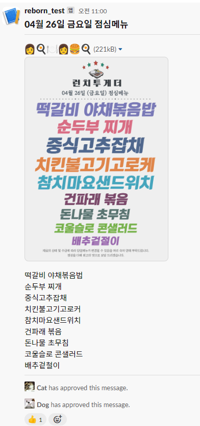

# slack-lunchtogether

- 월-금요일 11시, [playwright](https://playwright.dev/)를 이용해 카카오 채널의 프로필 메뉴 이미지를 다운로드하고 OCR을 [메뉴 이미지](result_image/ok/target.jpg)를 [OCR 대상 이미지](result_image/ok/crop.jpg)로 크롭 후, [파싱 결과](result_image/ok/result.jpg)를 슬랙으로 발송합니다.
  - [대상 이미지](result_image/fail/target.jpg)가 메뉴 표기가 아닌 경우, [파싱 진행 후](result_image/fail/result.jpg) 문자열을 파악하여 종료합니다.
    - 수정 및 테스트 진행 시 하기 변수를 수정하여 발송 및 다운로드 동작을 방지할 수 있습니다.
      ```python
      ...
      is_slack_submit = False
      is_menu_download = False
      ...
    - 프로필 이미지가 점심 메뉴가 아닌 시각이라면, 다음과 같이 파싱할 대상 이미지의 path를 고정 시켜 동작시킬 수 있습니다.
      ```python
      ...
      menu_image = os.path.join("./result_image/ok", "target.jpg")
      ...
      ```

## 💾 Installation

- Python 3.10.x 설치
  - 240426  기준 상위 버전 사용 시 오류 발생 (ppocr)
- 설치 및 경로 설정 완료 확인
```bash
> python --version
Python 3.10.11
...
> py
Python 3.10.11 (tags/v3.10.11:7d4cc5a, Apr  5 2023, 00:38:17) [MSC v.1929 64 bit (AMD64)] on win32
Type "help", "copyright", "credits" or "license" for more information.
...
```

개발 환경 구성을 위해 `root` 디렉터리에 가상 환경을 설정 :

```bash
python -m venv env
```

설정된 가상 환경을 활성화 :

- Windows:

```bash
. env/scripts/activate
```

- Mac/Linux:

```bash
. env/bin/activate
```

구성된 가상 환경의 패키지 매니저 업데이트:

```bash
python -m pip install --upgrade pip
```

동작 환경 구성에 필요한 필수 패키지 설치:

```bash
pip install -r requirements.txt
# 경우에 따라 실행
# playwright install-deps 
playwright install
```

## 🔧 Config

- `.env.example`을 복사, 참고 하여 `.env` 파일을 생성
  - SLACK_WEBHOOK_URL =  [slack api home](https://api.slack.com/)


## 🏃 Run

- 다음 명령어를 통해 해당 프로그램 실행 :

```bash
# 일반 실행(dev)
python run.py

# 도커를 이용한 실행(cron)
docker build -t slack-lunchtogether . && docker run -d slack-lunchtogether
```
